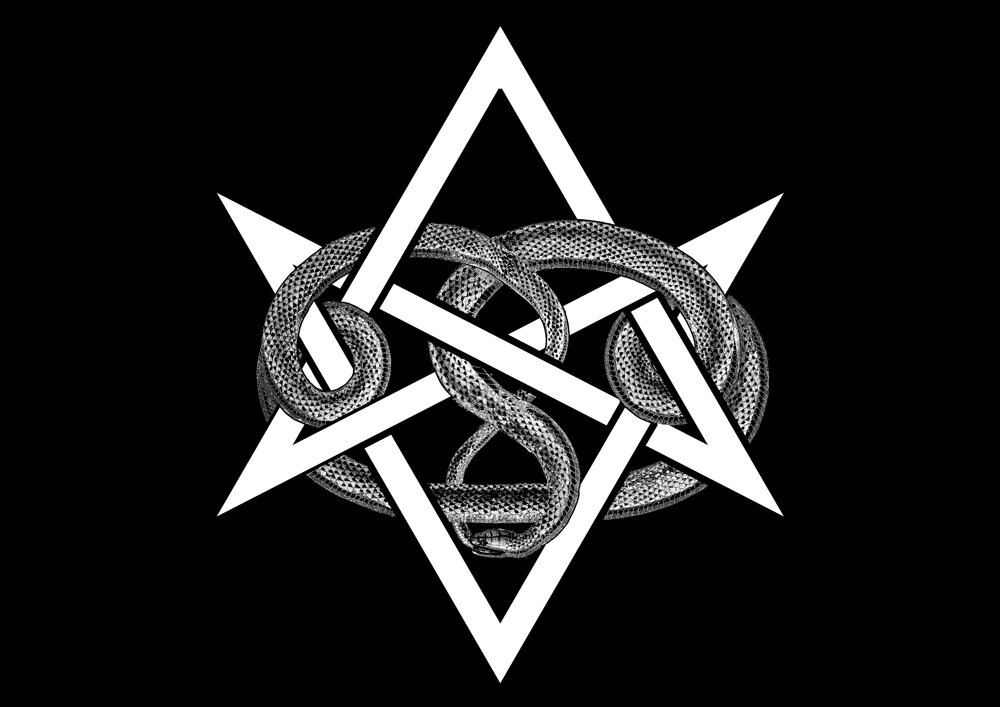
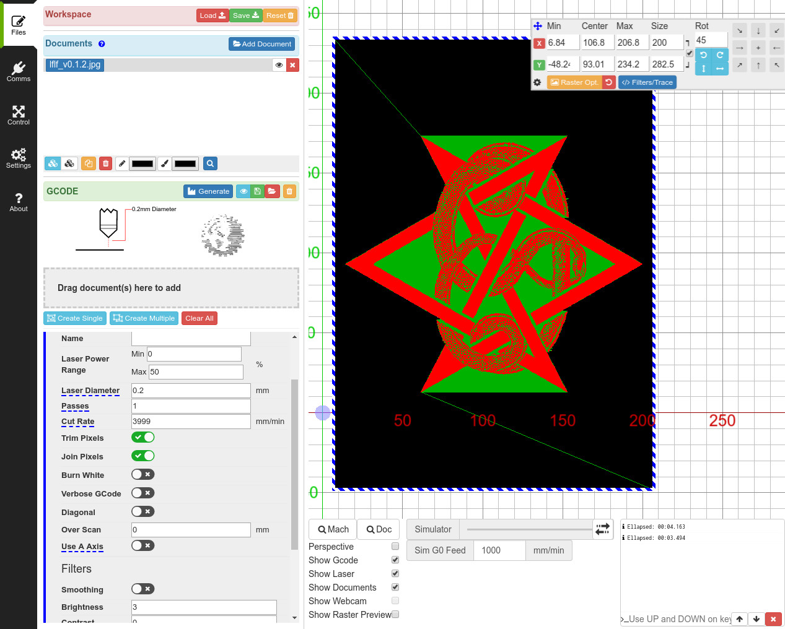

Live Fast, Live Forever - Light Up Patch
---

This is a project inspired by [Alzbeta Trojanova's](https://twitter.com/TaAlzbeta/status/1163131956902662145) [Cyberpunk 2077 jacket build](https://imgur.com/gallery/x0hWPJd).
Alzbeta printed a logo on light fabric and then used LED strips to illuminate it from behind.
I had thought that the LEDs would not be diffused enough or otherwise be too clunky but her build looks great and so I'd thought
I'd to do a similar build but with my own design.

A friend had pointed out the work of [Kain Morgenmeer](https://www.instagram.com/kain_morgenmeer/?igshid=wispu0p0m79n), specifically his picture of a [snake encircling a unicursal hexagram](https://www.instagram.com/p/BxzYuDTiSOY/).
Inspired by his work, I created my own take by using public domain art, using a file found from Wikipedia for the [unicursal hexagram](https://en.wikipedia.org/wiki/Unicursal_hexagram#/media/File:Interwoven_unicursal_hexagram.svg) and a page from a [book from 1734 on snake illustrations from Archive.org](https://archive.org/details/Locupletissimir2Seba/page/LXXI/mode/1up).
Both the unicursal hexagram and the snake illustration from Archive.org are public domain so I can reproduce them without fear of copyright infringement.

All files, including art, code and text for this build are under a free/libre license so please feel free to use, without permission, for your own purposes, be it commercial or otherwise!

Overview
---

The graphic is loaded into [LaserWeb](https://laserweb.yurl.ch/) to produce a GCode file that I use burn out the pattern on fabric.
The burnt pattern is then glued to white cloth which is in turn glued to a two ply stack of then insulation.
The insulation is then backed by strips of RGB LEDs and driven by an Arduino.

The RGB LEDs are put on a hard backing for support and attached to the stack of insulation and pattern via brass standoffs.
The whole assembly is then attached to the back of a jacket with a rough pattern cut out of the back.
The patch is glued onto the inside of the back jacket with M3 screws used to attach the patch to the jacket for extra support.

The Arduino drives the RGB LED strips and both the Arduino and LED strips are powered by LiPo battery through a 5V buck converter.

Materials
---

| | |
|---|---|
| Heavy Duty Nylon Cloth | [Amazon](https://www.amazon.com/gp/product/B002C6DAXE/) |
| White Cotton Cloth | [Amazon](https://www.amazon.com/Green-Gingham-Cotton-Flannel-Fabric/dp/B003TF3CNU) |
| Arduino Nano | [Amazon](https://www.amazon.com/ELEGOO-Arduino-ATmega328P-Without-Compatible/dp/B0713XK923) |
| 60Leds/M PCB 5050 RGB LED Strip (1M) | [Amazon](https://www.amazon.com/SUPERNIGHT-Changing-Non-waterproof-Flexible-Decoration/dp/B00E0EVHYA) |
| Mybecca Quilt Batting Dacron Fiber Polyester Wadding Fabric 1/2" Loft Upholstery Grade | [Amazon](https://www.amazon.com/gp/product/B00NUHDG6A) |
| 3M General Purpose 45 Spray Adhesive, 10.25 Ounce | [Amazon](https://www.amazon.com/gp/product/B000PCWRMC/) |
| LiPo Battery (14.8V, 1.5Ah) | [Amazon](https://www.amazon.com/1550mAh-Quadcopter-Helicopter-Airplane-Multi-Motor/dp/B0784CJTH1) |
| XT60 Connector | [Amazon](https://www.amazon.com/Female-Connector-Housing-Silicon-Battery/dp/B073QJWVVK/) |
| Blade Automotive Fuse Holder | [Amazon](https://www.amazon.com/Nilight-NI-FH01-Automotive-Holder-10-Warranty/dp/B07426WCLM) |
| DC-DC Buck Converter (5V 5A, 25W) | [Amazon](https://www.amazon.com/DROK-090581-Converter-Step-down-Transformer/dp/B00CE75K0W) |

Preparing the Pattern
---

| | |
|---|---|
|  | |

Using my rudimentary GIMP skills, I cleaned up, scaled and positioned the snake to interlace with the hexagram.
The original picture didn't have the snake eating it's own tail so I used a combination of cut and paste with
a healthy sampling of the `clone` tool to try and get a passable image of the snake eating it's own tail.

I then used the `threshold` tool to create a black and white image to prep for input into LaserWeb.
The `threshold` isn't strictly necessary as LaserWeb will create GCode with variable laser power depending
on the lightness but I find it easier to reason about the final image when thresholding is done.

Once the image was ready, I saved it as a JPEG and loaded it into LaserWeb.
The LaserWeb parameters I used were:

* 3999 cut speed
* 50% power
* Turn off the `Burn white` option
* Turn on the `Invert Color` option
* Set `Brightness` to `3`
* Rotate by 90 deg
* Width of 200 (mm) (after rotation)

This very much depends on the thickness of material you use and the laser cutter so these options can be played with.

The source `.xcf` GIMP file is available in case the thresholding for the image is something that people want to play with.

Some things to watch out for

* Any region that is completely cut off from the outside main fabric area will fall through, so the pattern should be designed
  to make sure there is one contiguous region that is connected, weaving through the cut portion of the fabric
* The scales are high detail and can get muddy when cut. The overall pattern (in my opinion) shines through but high detail areas
  have a hard time making it through. For example, the snake head could have been better detailed and is a bit muddy in the final
  cut
* Experimentation might need to be done to figure out which parameters are best for another workflow

Cutting the Pattern
---

Once the GCode is ready, I send it to my laser cutter to cut the pattern.
I left plenty of fabric on the outer edges that will be used to connect to the backing plate where the LED strips will placed
and where the fabric will be glued to the back of the jacket.

Creating the Fabric Patch
---

Cut two sections of the quarter inch insulation so that they are larger than the pattern.
Cut a section from the cotton white fabric that is as large as the pattern.
The insulation and cotton can be cut down it's better to err on the larger side.

Glue the pattern to the cut cotton section, using the spray adhesive.
To limit the amount of glue dispersal, try to spray the back of the pattern with the spray adhesive then place it on the cotton
fabric.

While that dries, glue the two insulation sections together using the spray adhesive.
Once both the insulation sheets have and the cotton to pattern glued sections have dried, glue the bottom of the cotton-pattern
section to the glued together insulation sections.

This is the patch that will be glued and fastened to the back of the jacket as well as fastened to the RGB LED strip backing.

Wiring the LED Strips
---

| | |
|---|---|
|  | |

The RGB LED strips are put on a hard backing to make sure they're secure from bending and fraying.
Since the RGB LEDs come in strips, they can be cut and wired to allow for different angles connected to
segments.

The segments have been positioned to follow the hexagram pattern for effect.
The cutting and rewiring of segments makes wiring more complicated and need not be done
if a simpler pattern is desired, the layout can be simplified by doing a zig zag or other pattern.

References
---

* [Twitter: Alzbeta Trojanova's post on her build](https://twitter.com/TaAlzbeta/status/1163131956902662145)
* [Imgur: Alzbeta Trojanova's Cyberpunk 2077 jacket wip build](https://imgur.com/gallery/x0hWPJd)
* [Instagram: Kain Morgenmeer](https://www.instagram.com/p/BxzYuDTiSOY/)
* [Wikipedia: Interlaced form of the unicursal hexagram](https://en.wikipedia.org/wiki/Unicursal_hexagram#/media/File:Interwoven_unicursal_hexagram.svg)
* [Archive.org: Locupletissimi rerum naturalium thesauri accurata descriptio, et iconibus artificiosissimis expressio, per universam physices historiam](https://archive.org/details/Locupletissimir2Seba/page/LXXI/mode/1up)
