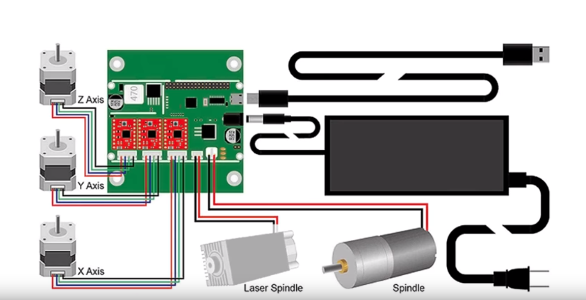
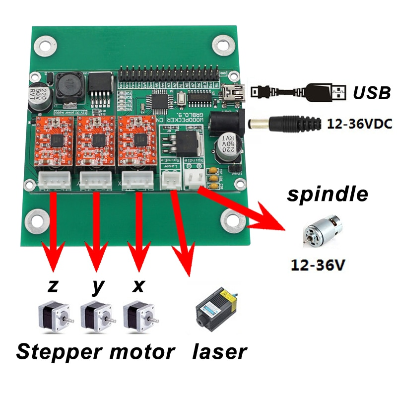
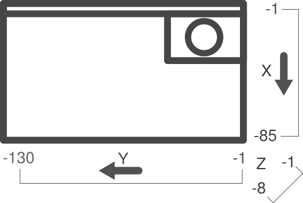
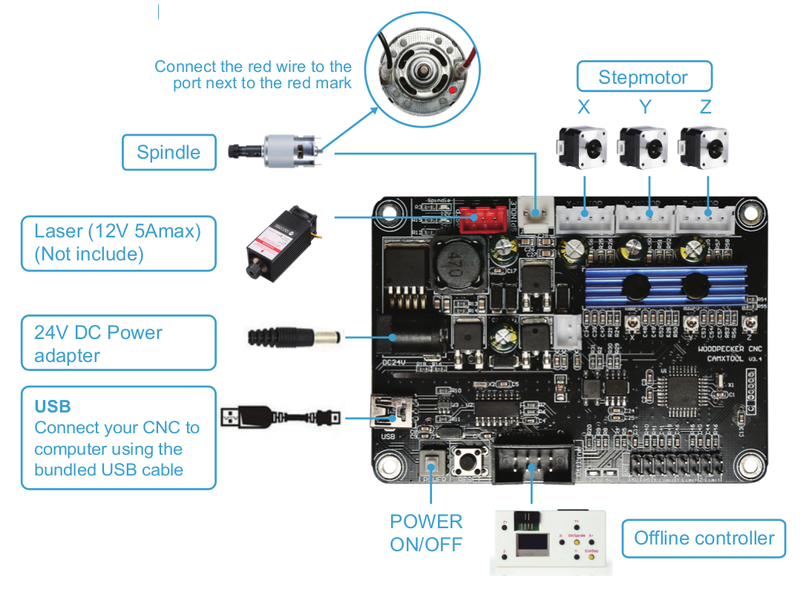

PCB CNC Development Log
===

This is a place to collect a development log
about the PCB CNC project(s) I'm doing.

2018-10-03
---

I purchased a CNC1610 for ~$180 from Amazon a couple of days ago.
It arrived unassembled and I used [3DSage's YouTube Assembly video](https://www.youtube.com/watch?v=XfhlZuw5mDs)
to help in my assembly.

One thing I didn't do is add a lot of washers I might want to do that if I don't want the screws
to constantly come out.

In order to put the channel screw anchors, I used a pair of tweezers to pick them up by the middle
and then twist them.
A "gotcha" for me was assembling the z-axis frame where I reversed the outer and inner channels.
I mistakenly used the 220mm length one as the 'up' direction and used the 200mm as the cross beams.
Reversing these the z-axis assembled correctly (see the [appropriate point in the video](https://www.youtube.com/watch?v=XfhlZuw5mDs&t=135)).

Hooking up the motors, I successfully moved all three axies.
I used minicom to put it through it's paces:

```
minicom -s -c on -D /dev/ttyACM0
```

The common values are `/dev/ttyACM0` and `/dev/ttyUSB0`.

I believe the config values for minicom are:

* `115200 8N1`
* `Hardware Flow Control : Yes`
* `Software Flow Control : No`

I didn't put the cross beams for the z-axis close enough so I had to unscrew them and realign them
to have all four anchor points connect to the Arduino/GRBL shield connect to the back.

I labelled the axies on the board with a sharpie.






From [gne/grbl issue #123](https://github.com/gnea/grbl/issues/123#issuecomment-279131776), the pinout looks to be the following (though this should be double checked):

> The external contacts are all GND.

| name | description  |
|------|--------------|
| xen  | Limit-X-Axis |
| xen  | Limit-X-Axis |
| yen  | Limit-Y-Axis |
| yen  | Limit-Y-Axis |
| zen  | Limit-Z-Axis |
| zen  | Limit-Z-Axis |
| A5 | Probe |
| A4 | |
| A3 | Coolant Enable |
| A2 | Cycle Start/Resume |
| A1 | Feed Hold |
| A0 | Reset/Aboat |
| A7 | |
| A6 | |
| D13 | Spindel Direction |
| RST | |
| 5V | |

My bet is that each of the axies of the `[xyz]en` pins are connected (so `xen` has two pinouts but is connected)
so that you can plug the limit switches directly in for each side without having to create extra wiring.


2018-10-27
---

I'm still fussing with the homing cycle and getting it into a state that I think is reasonable but the limit switches are attached
and working.

The z-axis limit switch is still a bit hinky so there's some room for improvement but for now it's functional.
For some reason, the other pin pair that should be `zen` isn't working on the board.
I wired both z-axis limit switches in parallel to get the effect.

Here's a current snapshot of the state:

```
$0=10 (step pulse, usec)
$1=25 (step idle delay, msec)
$2=0 (step port invert mask:00000000)
$3=4 (dir port invert mask:00000100)
$4=0 (step enable invert, bool)
$5=0 (limit pins invert, bool)
$6=0 (probe pin invert, bool)
$10=3 (status report mask:00000011)
$11=0.010 (junction deviation, mm)
$12=0.002 (arc tolerance, mm)
$13=0 (report inches, bool)
$20=1 (soft limits, bool)
$21=1 (hard limits, bool)
$22=1 (homing cycle, bool)
$23=3 (homing dir invert mask:00000011)
$24=25.000 (homing feed, mm/min)
$25=500.000 (homing seek, mm/min)
$26=250 (homing debounce, msec)
$27=1.000 (homing pull-off, mm)
$100=800.000 (x, step/mm)
$101=800.000 (y, step/mm)
$102=800.000 (z, step/mm)
$110=5000.000 (x max rate, mm/min)
$111=5000.000 (y max rate, mm/min)
$112=800.000 (z max rate, mm/min)
$120=10.000 (x accel, mm/sec^2)
$121=10.000 (y accel, mm/sec^2)
$122=10.000 (z accel, mm/sec^2)
$130=100.000 (x max travel, mm)
$131=100.000 (y max travel, mm)
$132=30.000 (z max travel, mm)
```

2019-12-22
---

To test limit switches, set the `$10` variable appropriately:

```
$10=16
```

From the [GRBL wiki](https://github.com/grbl/grbl/wiki/Configuring-Grbl-v0.9#10---status-report-maskbinary):

| Report Type | Value |
|---|---|
| Machine Position | 1|
| Work Position | 2 |
| Planner Buffer | 4 |
| RX Buffer | 8 |
| Limit Pins | 16 |

Once I had confidence the limit switches were working, I put it through the homing cycle after turning on limit switches and enabling the homing cycle:

```
$21=1
ok
$22=1
ok
$H
ok
$10=1
```

I'm still having trouble getting the bounding box of work to be correct. No matter which direction setting I choose, it wants the x,y and z axis to all be negative.

---

I put the collet on using a clamp to press it on.
The collet (ER11) was slightly too small and so had to be press fit.

---

One of the EBay listings reports that the motor is 7k rpm.
To start and stop the motor:

```
M3 S7000
M5 S0
```

---

I'm still workign on height probing but the following command is probably what I want:

```
G38.2 Z-2.5 F1
```

2020-01-09
---



I'm using M5 bolts with washers and channel nuts to fasten a piece of FR4 down.

The next task is to generate and run some calibration patterns as well as to run a script to generate a height map. 

2020-03-02
---

Doing a test run of a cut I've measured the kerf at `0.3mm`.

2020-08-19
---

I've purchased a CNC3-3018Pro.

It looks to be running GRBL 1.1f.

Some relevant commands (see the [grbl docs](https://github.com/gnea/grbl/wiki/Grbl-v1.1-Commands#grbl--commands)):

| | |
|---|---|
| `$#` | Show gcode parameters | Probe is `PRB` |
| `G38.2` | Probe towards target, stops on contact, error if probe does not trigger | `G38.2 [<frate>] [<xpos>] [<ypos>] [<zpos>]`  |
| `G38.3` | Probe towards target, stops on contact, no error if probe does not trigger | `G38.3 [F<frate>] [X<xpos>] [Y<ypos>] [Z<zpos>]`  |
| `G38.4` | Probe away target, stops on loss of contact, error if probe does not trigger | `G38.4 [<frate>] [<xpos>] [<ypos>] [<zpos>]`  |
| `G38.5` | Probe away target, stops on loss of contact, no error if probe does not trigger | `G38.5 [<frate>] [<xpos>] [<ypos>] [<zpos>]`  |

The `A5` pin should be used for the probe.

| | |
|---|---|
|  |  |


