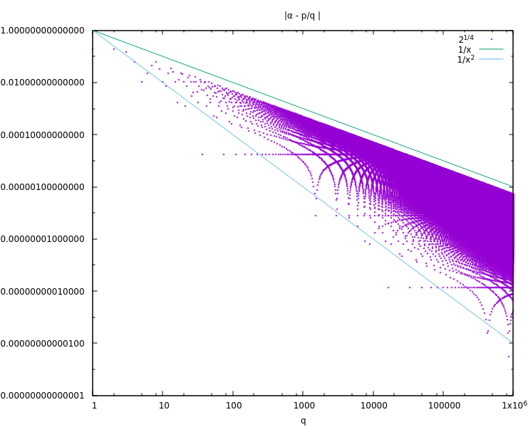

Diophantine Approximation
===

Dirichlet's Approximation Theorem
---

$$
\begin{array}{c}
\forall \alpha \in \mathbb{R}, \forall n \in \mathbb{Z}\_{+} \\\\
\exists p, q \in \mathbb{Z}\_{+}, \\ \\ 1 \le q \le n \\\\
\to 0 < | q \alpha - p | < \frac{1}{n} \\\\
\end{array}
$$

Consider

$$
\begin{array}{c}
r_q = q \alpha - \lfloor q \alpha \rfloor \\\\
r_q \in [0,1) \\\\
\end{array}
$$

Allow for $r_0 = 0$ and there
are $(n+1)$ points for $(0 \le q \le n)$, $r_q$, in the unit interval.
By pigeonhole, there must be two that fall in some interval $[\frac{s}{n}, \frac{s+1}{n})$ for $0 \le s < n$.

Call the two points $r_m$ and $r_l$, $\\ m > l$.

$$
\begin{array}{cl}
& |r_m - r_l| < \frac{1}{n} \\\\
\to & | \\{ m \alpha \\} - \\{ l \alpha \\} | < \frac{1}{n} \\\\
\to & | (m \alpha - \lfloor m \alpha \rfloor) - (l \alpha - \lfloor l \alpha \rfloor) | < \frac{1}{n} \\\\
\to & | (m - l) \alpha - (\lfloor m \alpha \rfloor - \lfloor l \alpha \rfloor ) | < \frac{1}{n} \\\\
\end{array}
$$


$$
\begin{array}{cl}
 & q' = m - l \in \mathbb{Z} \\\\
 & p' = (\lfloor m \alpha \rfloor - \lfloor l \alpha \rfloor )  \in \mathbb{Z} \\\\
\to & | q' \alpha - p' | < \frac{1}{n}
\end{array}
$$

---

So long as $\alpha$ is irrational:

$$
\begin{array}{cl}
 & | \alpha - \frac{p}{q} | < \frac{1}{q n} < \frac{1}{n} \\\\
\to & | \alpha - \frac{p}{q} | > \frac{1}{C}
\end{array}
$$

For some constant, $C$.

We can now pick an $n'$ s.t.:

$$
\begin{array}{cl}
 & \frac{1}{n'} < \frac{1}{C} \\\\
\to & | \alpha - \frac{p'}{q'} | < \frac{1}{C}
\to & q' \ne q
\end{array}
$$

So there are infinitely many pairs, $\{p,q\}$ s.t. $ | q \alpha - p | < \frac{1}{n} $.

---

Rearranging,

$$
\begin{array}{cl}
& | \alpha - \frac{p}{q} | < \frac{1}{q n} < \frac{1}{q^2} \\\\
\to & | \alpha - \frac{p}{q} | < \frac{1}{q^2}
\end{array}
$$

Note that this only says "there exists" a $q$ and is not a relation for all $q$.

$$
\begin{array}{cl}
& \forall \alpha \in \mathbb{R}, \forall n_0 \in \mathbb{Z}\_{+} \\\\
& \exists p,q \in \mathbb{Z}\_{+}, \\ \\ q > n_0 \\\\
\to & | \alpha - \frac{p}{q} | < \frac{1}{q^2}
\end{array}
$$

---


Here is an example for $2^{\frac{1}{4}}$:


```
#!/usr/bin/python3
import gmpy2
with gmpy2.local_context(gmpy2.coneext(), precision=1000) as ctx:
  x = gmpy2.sqrt(gmpy2.sqrt(2))
  N = 1000000
  for q in range(1,N):
    pf = gmpy2.floor(q*x)
    pc = gmpy2.ceil(q*x)
    r = q*x - pf
    rp = pc - q*x
    if (r<rp):
      y = x - (pf/gmpy2.mpfr(q))
      print(q,y)
    else:
      y = (pc/gmpy2.mpfr(q)) - x
      print(q,y)
```



Liouville Bounds
---

For $\alpha$ the root of a polynomial of degree $n$:

$$
\begin{array}{cc}
\forall p(x) = \sum_{k=0}^{n} c_k x^k, & c_k \in \mathbb{Z}, \\ \\ p(\alpha) = 0 \\\\
\exists A > 0, & \forall p,q \in \mathbb{Z}\_{+} \\\\
| \alpha - \frac{p}{a}|  > \frac{A}{q^n}
\end{array}
$$

$\alpha_k$ the roots of $p(x)$ above, with $\alpha$ distinct from the rest, and $M$ is the maximum value of $|p'(x)|$ on the interval $[\alpha-1,\alpha+1]$:

$$
A < \text{min} \left( 1, \frac{1}{M}, | \alpha - \alpha_1|, | \alpha - \alpha_2|, \cdots, |\alpha - \alpha_{n-1}| \right)
$$

Assume, for contradiction, some $p,q$, with $p(\frac{p}{q}) \ne 0 $ s.t.:

$$
| \alpha - \frac{p}{a} | \le \frac{A}{q^n} \le A < \text{min} \left( 1, \frac{1}{M}, | \alpha - \alpha_1|, | \alpha - \alpha_2|, \cdots, |\alpha - \alpha_{n-1}| \right)
$$

My the mean value theorem:

$$
\begin{array}{cc}
& p(\alpha) - p(\frac{p}{q}) = (\alpha - \frac{p}{q}) \cdot p'(x_0) \\\\
\to & | \alpha - \frac{p}{q}| = \frac{ |p(\alpha) - p(\frac{p}{q}) }{ | p'(x_0) | }  \\\\
\to & | \alpha - \frac{p}{q}| = | \frac{p(\frac{p}{q})}{ p'(x_0) } | \\\\
\to & | \alpha - \frac{p}{q}| = | \frac{ \sum_{k=0}^{n} c_k p^k q^{-k} }{ p'(x_0) } |  \\\\
\to & | \alpha - \frac{p}{q}| = \frac{1}{q^n} | \frac{ \sum_{k=0}^{n} c_k p^k q^{n-k} }{ p'(x_0) } |  \ge \frac{ \frac{1}{q^n} }{ p'(x_0) } \\\\
\to & | \alpha - \frac{p}{q}| \ge \frac{ \frac{1}{q^n} }{ p'(x_0) } \ge \frac{ \frac{1}{q^n} }{ M } > \frac{A}{q^n} \ge | \alpha - \frac{p}{q} | \\\\
\to & | \alpha - \frac{p}{q}|  > | \alpha - \frac{p}{q} | \\\\
\end{array}
$$

A contradiction, so the inequality holds.


###### 2020-05-22
